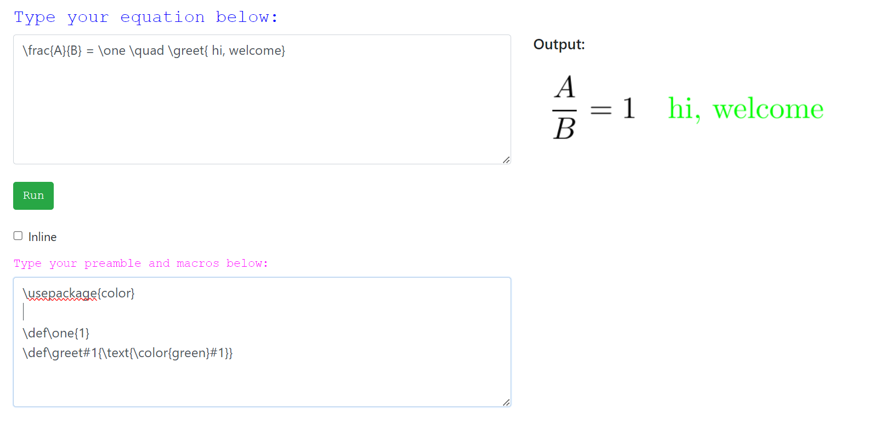

# Equation-Compiler
Compile TeX equation and generate png as output

### What it will do
it is just a simple `TeX` compilation API which recieve equation code from user and create png as output.
API has simple html form for getting input from user and display image.

### sample screen snap
#### home page

#### compilation output

#### compilation error

