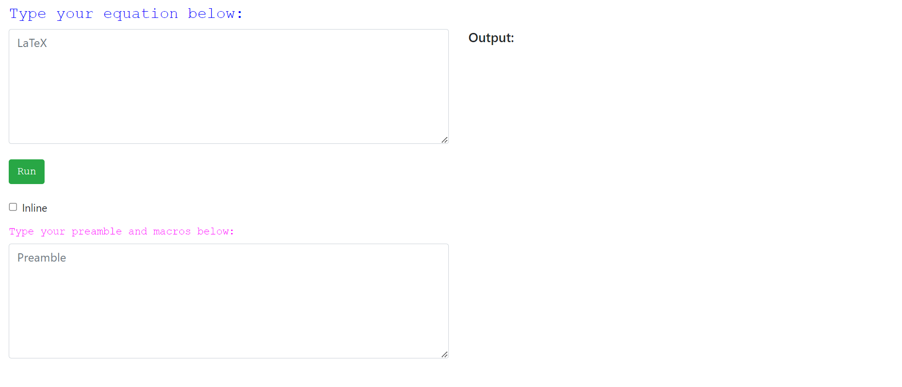
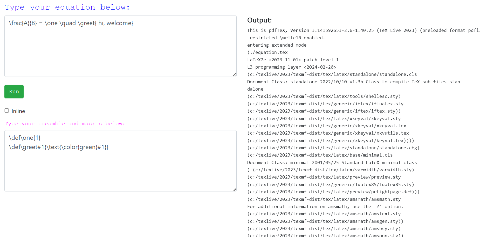

# Equation-Compiler
Compile TeX equation and generate png as output

### What it will do
it is just a simple `TeX` compilation API which recieve equation code from user and create png as output.
API has simple html form for getting input from user and display image.

### sample screen snap
#### home page

#### compilation output
Image will display right hand side. Option given to add standard `TeXLive` packages and custom macros. Those optional will be included in equation's tex preample before compilation.

#### compilation error
If error occurred during compilation time, log information will display to find the root cause.

